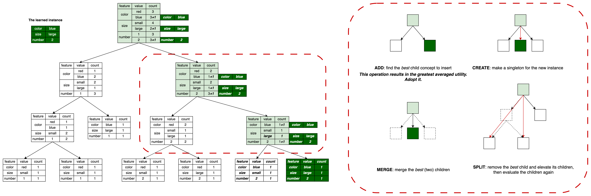
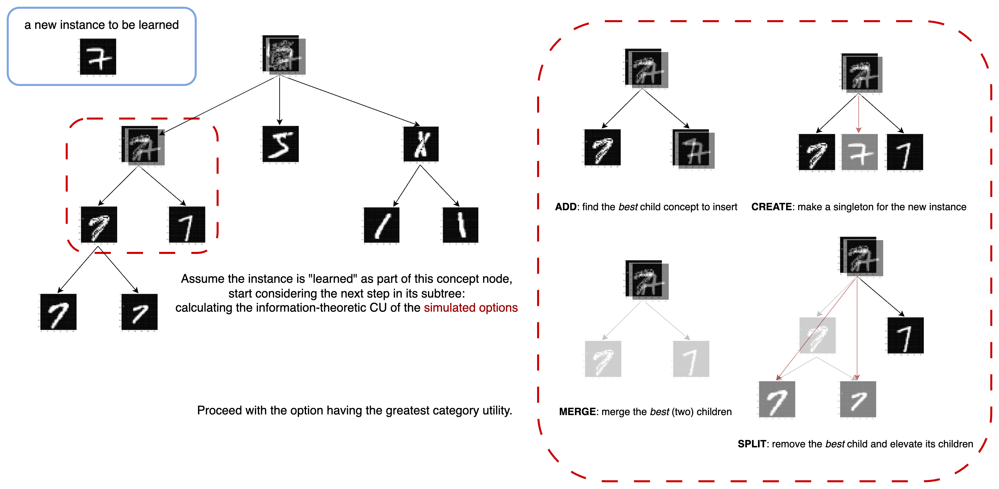

# Cobweb: Human-Like Concept Formation

In this repo, we introduce the implementation of the concept formation system, ***Cobweb***, and its employment in `tabular`, `vision`, and `language` tasks. 

To install it as a Python library, first install the pybind11 library with your preferred [method](https://pybind11.readthedocs.io/en/stable/installing.html) if you haven't to compile the C++ scripts into Python libraries. Make sure you has some C++ complier in your server.

After that, simply clone or download it to the server you are using and install with the following:

	pip install -e [your-directory]/cobweb

The foundational work of Cobweb can be seen [here](https://link.springer.com/article/10.1007/BF00114265), which adopts instances represented with nominal attribute (feature) values. Its (first) variation, [*Cobweb/3*](https://ntrs.nasa.gov/api/citations/19920016495/downloads/19920016495.pdf), adopts instances represented with continuous attribute values. 

In this repo (and the [AAAI-24 tutotial presentation](https://humanlikelearning.com/aaai24-tutorial/)), we summarize the endeavors made for the Cobweb studies in years and present the revised Cobweb implementation nature. There are two variations of Cobweb in this repo: 
- One learning instances represented with nominal attribute values (`cobweb.cpp`, used in the `tabular` and `language` tasks), and 
- the other one learning instances represented with continuous attribute values with the help of PyTorch tensors (`cobweb_torch.py`, used in the `vision` tasks, also called ***Cobweb/4V***).

The implementation examples for `tabular`, `vision`, and `language` tasks are available in the corresponding folders `./example/tabular(vision, language)` in this repo.

</br>
_________________

### Nominal Cobweb Core Implementations (for tabular and language tasks)


<figure>
    
    <figcaption>An illustrative example of Cobweb's learning process involves incorporating a new instance (the dark green table). Cobweb traverses the tree from the root to a specific leaf node, and along this path, the concept nodes (in light green) should encompass the given instance. During this process, Cobweb evaluates each subtree and considers four available operations, then proceeds with the operation yielding the highest averaged category utility within the subtree.</figcaption>
</figure>

In the implementation (with `cobweb.cpp`), a Cobweb tree is initialized with a `CobwebTree` object, with its concept nodes represented with `CobwebNode` objects.

#### Compile `cobweb.cpp` with pybind11

To make use of the (nominal) Cobweb implementation in Python, you *have to* obtain the corresponding compiled Python `cobweb` library from `cobweb.cpp`. One (most prevalent) way to compile `cobweb.cpp` is to use the [`pybind11`](https://pybind11.readthedocs.io/en/stable/index.html) library.

If you install this repo as a Python library to your local PC, it will automatically compile the `cobweb.cpp` for you, and you can just import modules from this script (package) like any other Python libraries: `from cobweb import cobweb`. The `cobweb` you will be importing is the compiled package file (with the file name like `cobweb.cpython-311-darwin.so`, indicating the package is compatible in Python 3.11) instead of `cobweb.cpp`.

*However*, if you fail to have the compiled `cobweb.cpp` when installing this repo as a Python library, or you want to do it manually, here are the *no-brainer* implementation steps:

- First install the pybind11 library with your preferred [method](https://pybind11.readthedocs.io/en/stable/installing.html) if you haven't, and make sure you has some C++ complier in your server. For example, if you are using Mac operating systems (like me), feel free to proceed the following steps with the `c++` complier by default, and I would be using the `c++` compiler as an example in the following - I believe it is of the same format for alternative compilers like `g++`.

- Launch the terminal under this repo (where the C++ script `cobweb.cpp` with `BS_thread_pool.hpp`, `cached_string.hpp` and `json.hpp` lies) and enter:

	```
	c++ -O3 -Wall -shared -std=c++17 -undefined dynamic_lookup $(python3 -m pybind11 --includes) cobweb.cpp -o cobweb$(python3-config --extension-suffix)
	```

to start compiling. 

- After the library is compiled successfully, you can start playing with the (nominal) Cobweb! Always import it as `cobweb`, the name of the library.


#### Instance Representations

After having the complied `cobweb.cpp` package to use, you can start trying training and predicting the instances you have. Each instance should eventually be preprocessed to corresponding dictionaries in the following format:

	{'attribute1': {'value1': count11, 'value2': count12, ...},
	 'attribute2': {'value1': count21, 'value2': count22, ...},
	 ...}

All the keys (`attribute` or `value`) should be in strings. Some example representations:

- A small blue sweater which is on sale.
	```
	{'size': {'small': 1}, 'color': {'blue': 1}, 'on-sale': {'Y': 1}}
	```

- A sample indicating a patient is diagnosed with Gastroenteritis with the symptoms: vomiting, dehydration, and diarrhoea.

	```
	{'disease': {'gastroenteritis': 1}, 
	 'symptom': {'vomiting': 1, 'dehydration': 1, 'diarrhoea': 1}}
	``` 

- A bag-of-words with window size 3 and the anchor word `article` in the sentence: `please read the article before coming to class today`.
	```
	{'anchor': {'article': 1}, 
	 'context': {'please': 1/3, 'read': 1/2, 'the': 1, 'before': 1, 'coming': 1/2, 'to': 1/3}}
	```


#### Initialize a Cobweb Tree

After importing the `cobweb` module, initialize the Cobweb tree object by 

	CobwebTree(alpha, weight_attr, objective, children_norm, norm_attributes=True)

* `alpha (float)`:the value of the "smoothing factor" in calculating the measures and probabilities, and it is useful especially when some concept node hasn't learned the feature value in previous learning.
* Not all the learned instaces have specified values in all available attributes. `weight_attr=True` if in the calculation of measure and probability values, the proportion of learned instances having observed values in corresponding attributes is considered, otherwise `False`.
* `objective (int) = {0, 1, 2}` is the index choosing to use in the measure calculation. `0`: mutual information (entropy); `1`: normalized mutual information; `2`: normalized uncertainty.
* `norm_attributes=True` if the measure is always divided by the number of children in a subtree, otherwise `False`.

To implement the latest revised Cobweb variety, you can initialize it with

	CobwebTree(alpha=0.00001, weight_attr=False, objective=0, children_norm=True)

with no-brainer.

#### Learning

To make Cobweb tree learn a single instance `inst`, use 

	CobwebTree.ifit(inst)

For a set of instances, Cobweb can either learn them by a `for` loop with `.ifit`, or directly train them with 

	CobwebTree.fit(instances)

where `instances` is a list of `inst`s.


#### Predicting

The hierarchical cognitive structure of Cobweb offers its variety of predictions at different concept levels, or even generate  predictions with expanded concept nodes. Also, the unity between the "dependent" and "independent" attributes (variables) offers Cobweb the capability of *multi-task* learning and predicting - Cobweb can predict the value of any attribute given an instance. 

Given an instance `inst` with an unobserved attribute value to predict, we offer several ways of predicting (at different level of concepts, or the combined prediction from multiple expanded concepts):

- To make an attribute-value prediction at a single concept node,

	* Cobweb should first find the leaf node to categorize the instance with
	```
	leaf = CobwebTree.categorize(inst)
	```
	* You can even alter the concept you will use for prediction after finding the leaf node categorization of the instance:
	```
	basic_node = leaf.get_basic_level()  # reach its basic-level concept
	best_node = leaf.get_best_level()  # reach its "best" level concept which has the most P(concept|instance) along the concept path
	```

	* You can then make predictions with the node you use:
	```
	CobwebNode.predict_probs()
	```
	It returns a dictionary indicating the predicted probabilities of each possible attribute value under all attributes in the following format:
	```
	{'attribute1': {'value1': prob11, 'value2': prob12, ...},
	 'attribute2': {'value1': prob21, 'value2': prob22, ...},
	 ...}
	```
	Then for the attribute you are predicting, find the corresponding value with the highest probability.

- To make a combined prediction with multiple expanded nodes, use
	```
	CobwebTree.predict_probs(instance=inst, max_nodes, greedy, missing, obj)
	```
	where
	* `max_nodes (int)` is the maximum number of nodes used in making an ensembled prediction.
	* `greedy=True` if Cobweb finds nodes in a single greedy path, and `greedy=False` if it instead uses best-first search to find nodes.
	* `missing=True` if the missing attribute values are considered when categorizing, otherwise `False`.
	* `obj (int) = {0, 1, 2, 3}` is the index of the objective function used in categorization.

To implement the latest revised Cobweb variety, you can make a prediction with

	CobwebTree.predict_probs_mixture(instance=inst, max_nodes=50, greedy=False, missing=False, obj=1)

with no-brainer.


</br>
_________________

### Quantitative Cobweb Core Implementations (for vision tasks)


<figure>
    
    <figcaption>An illustrative example of Cobweb's learning process involves incorporating a new image (in the blue square frame). Cobweb traverses the tree from the root to a specific leaf node, and along this path, the concept nodes should encompass the given instance. During this process, Cobweb evaluates each subtree and considers four available operations, then proceeds with the operation yielding the highest averaged category utility within the subtree.</figcaption>
</figure>

In the implementation (with `cobweb_torch.py`), a Cobweb tree is initialized with a `CobwebTorchTree` object, with its concept nodes represented with `CobwebTorchNode` objects.


#### Instance Representations

Thanks to the prevalent use of deep learning framework `PyTorch`, we can (and we *need to*) represent the instances with Torch tensors to boost our implementations! An MNIST data example:

	tensor([[[0.0000, 0.0000, 0.0000, 0.0000, 0.0000, 0.0000, 0.0000, 0.0000,
          0.0000, 0.0000, 0.0000, 0.0000, 0.0000, 0.0000, 0.0000, 0.0000,
          0.0000, 0.0000, 0.0000, 0.0000, 0.0000, 0.0000, 0.0000, 0.0000,
          0.0000, 0.0000, 0.0000, 0.0000],
         ...
         [0.0000, 0.0000, 0.0000, 0.0000, 0.0000, 0.0000, 0.0000, 0.0000,
          0.0000, 0.0000, 0.0000, 0.4627, 0.9922, 0.9922, 0.9922, 0.1490,
          0.0000, 0.0000, 0.0000, 0.0000, 0.0000, 0.0000, 0.0000, 0.0000,
          0.0000, 0.0000, 0.0000, 0.0000],
         ...
         [0.0000, 0.0000, 0.0000, 0.0000, 0.0000, 0.0000, 0.0000, 0.0000,
          0.0000, 0.0000, 0.0000, 0.0000, 0.0000, 0.0000, 0.0000, 0.0000,
          0.0000, 0.0000, 0.0000, 0.0000, 0.0000, 0.0000, 0.0000, 0.0000,
          0.0000, 0.0000, 0.0000, 0.0000]]])

In a concept learning/classification task, we assume that each instance has its label feature value (`label (int)`). For example, for an image instance in the MINST dataset, the label varies from `0` to `9`.


#### Initialize a Tree

After importing `cobwweb_torch` module, intialize a tree by

	CobwebTorchTree(shape, use_mutual_info=True, acuity_cutoff=False, prior_var=None, alpha=1e-8, device=None)

* `shape (torch.Size)` is the `torch.Size` object indicating the size of each instance as a Torch tensor. MNIST example: `torch.Size([1, 28, 28])`

* `use_mutual_info=True` if the used measure is the mutural information measure (entropy), and if it is `False`, the used measure is the category utility for continuous values (adopted in Cobweb/3) instead.

* `acuity_cutoff=False` if introducing the acuity (noise) when calculating the standard deviation in the concept's attribute-value distribution, otherwise `True`.

* `prior_var (float or None)` is the value of the (squared) acuity. If `prior_var=False` it is assigned with value `1 / (4 * pi)` by default.

* `alpha (float)` is the "smoothing" parameter value like the one in the nominal Cobweb.

* `device (str or None)` indicates the device you want to use for the implementation. If it is `None` it will use the default CPU then.


#### Learning

Cobweb learns an instance (represented by `inst`) along with its corresponding label attribute value `label (int)` by the following:

	CobwebTorchTree.ifit(inst, label)

To learn a list of instances, you need to iterate with a `for`-loop.


#### Predicting

Just like the nominal Cobweb, it can make a label prediction given an instance with different approaches. Given an instance `inst`, we offer several ways of predicting (at different level of concepts, or the combined prediction from multiple expanded concepts):

- To make a label prediction at a single concept node,

	* Cobweb should first find the leaf node to categorize the instance with
	```
	leaf = CobwebTorchTree.categorize(instance=inst, label=None, use_best=True, greedy=False, max_nodes=float('inf'))
	```

	`greedy=True` if Cobweb finds nodes in a single greedy path, and `greedy=False` if it instead uses best-first search to find nodes.

	You may want to adjust the value of `max_nodes` if you don't want Cobweb to visit all the nodes when seeking the one with the greatest measure value.

	* You can even alter the concept you will use for prediction after finding the leaf node categorization of the instance:
	```
	basic_node = leaf.get_basic()  # reach its basic-level concept
	best_node = leaf.get_best(instance=inst, label=None)  # reach its "best" level concept which has the most P(concept|instance) along the concept path
	```

	* You can then make predictions with the node you use:
	```
	inst_pred, label_pred = CobwebTorchNode.predict(most_likely=True)
	```
	It returns the mean Tensor within the concept node `inst_pred` along with the predicted label value `label_pred`.


- To make a combined prediction with multiple expanded nodes, use

	```
	CobwebTorchTree.predict_probs(instance=inst, label=None, greedy=False, max_nodes=float('inf'))
	```

	* `max_nodes (int)` is the maximum number of nodes used in making an ensembled prediction.
	* `greedy=True` if Cobweb finds nodes in a single greedy path, and `greedy=False` if it instead uses best-first search to find nodes.

	It returns a dictionary indicating the predicted probabilities of each possible label attribute value in the following format:
	```
	{'label1': prob1, 'label2': prob2, ...}
	```

	You can then return the predicted label by finding the one with the most predicted probability.

</br>
_________________

### Main Contributors

[Christopher MacLellan](https://chrismaclellan.com/), [Xin Lian](https://xinthelian.github.io/), [Nicki Barari](https://www.linkedin.com/in/nickibarari/), and [Erik Harpstead](http://www.erikharpstead.net/). Arranged by Xin Lian.


