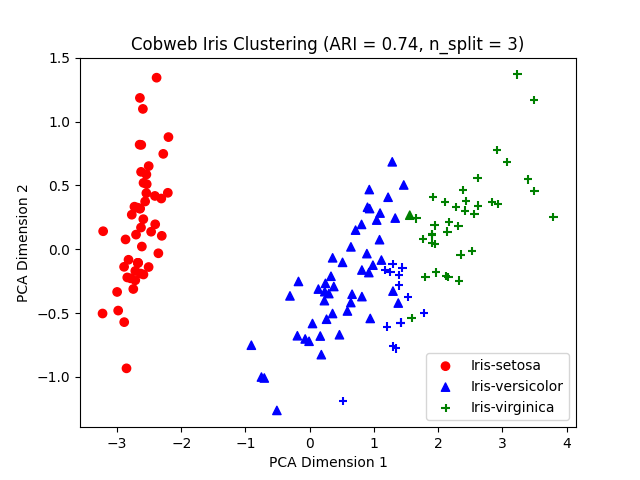

Here we employ the [Iris dataset](https://archive.ics.uci.edu/dataset/53/iris) (`iris.json` in the current directory) - each instance is represented with continous (quantitaive) attributes and one nominal attribute indicating its classification. One example is as the following:

    {"class": "Iris-virginica", "petal length": 6.1, "petal width": 2.5, "sepal length": 7.2, "sepal width": 3.6}

its attribute `class` indicates its categorical value, and the remaining attributes are continuous. 

    import numpy as np
    import torch
    import copy
    import random
    import json
    from tqdm import tqdm
    from cobweb.cobweb_torch import CobwebTorchTree
    from cobweb.visualize import visualize

We first set up the random seed to do fixed shuffling:

    seed = 100  # the random seed
    random.seed(seed)

Then load the instances stored in the JSON file:

    with open('iris.json', 'r') as file:
        instances = json.load(file)
    random.shuffle(instances)  # shuffled

`CobwebTorchTree` takes tensors (storing continuous values) as inputs, we need to first split the classification of each instance out, then transform the instances into corresponding tensors in PyTorch:

    instance_no_class = [{k: instance[k] for k in instance if k != 'class'} for instance in instances]  # remove the class attribute
    classes = [instance[c] for instance in instances for c in instance if c == 'class']  # store the classifications in a separate list
    instance_tensors = [torch.tensor([instance[k] for k in instance]) for instance in instance_no_class]  # the instances used for training and testing CobwebTorchTree

## Train the Cobweb Tree

First initialize the tree:

    tree = CobwebTorchTree(instance_tensors[0].shape)  # the initialization needs the size of each instance tensor

Then train the instances:

    for i in tqdm(range(len(instance_tensors))):
        tree.ifit(instance_tensors[i], classes[i])

And you can visualize the concepts generated in the trained tree:

    visualize(tree)

<figure>
    
    <figcaption>The visualization interface of the trained Cobweb tree. You can select the attribute you want to focus on with the `Focus Attributer` tab, and select (zoom in/out) the learned concept by directly clicking the concept/cluster circle. The corresponding attribure-value table (i.e. the stored information of a concept node) is shown on the lower right. </figcaption>
</figure>

## Predict the Class of a Given Instance

We can make a prediction of some instance's `class` value:

    instance_te = instance_tensors[15]  # the example instance
    pred_label = tree.categorize(instance_te).predict()[1]

Here we derive the predicted `class` value by first categorize the example instance into some leaf of the trained tree (without making adjustments), then make the prediction based on the "most likely" class value of the concept it is classified to.

We can compare the prediction and its ground-truth class value:

    print(pred_label, classes[15])  # Iris-setosa Iris-setosa

## Derive a Clustering/Partition of the Learned Instances with Cobweb

Cobweb presents a hierarchical clustering instead of a flat clustering/partition like many other statistical model do, but one actually can generate a partition of the learned instances by choosing a collection of concepts which store attribute-value counts of distinct learned instances to each other. 

    from sklearn.metrics import adjusted_rand_score
    from sklearn.feature_extraction import DictVectorizer
    import matplotlib.pyplot as plt
    from sklearn.decomposition import PCA
    from cluster import cluster

We here import the `cluster` module from the `cluster.py` in the same directory.

    n_split = 3
    assert n_split > 1, "the number of clusters should be greater than 1"
    assert n_split <= 7, "the number of clusters should be less than 8 (in this example)"

`n_split` is the number of splits we are going to do with the Cobweb tree - it is not necessarily the number of clusters in the output clustering.

    tree = CobwebTorchTree(instance_tensors[0].shape)
    cluster_iter = cluster(tree, instance_tensors, instance_tensors[0].shape, 
        min_split=1, max_split=n_split)  # An iterable, from n_split=min_splits to max_splits
    if n_split > 1:
        for i in range(n_split - 1):
            clusters = next(cluster_iter)

After generating a clustering with the specific `n_split`, we can compare the derived clustering with the ground-truth classifications of the instances with the Rand Index (RI), a similarly measure between two clusterings by "considering all pairs of samples and counting pairs that are assigned in the same or different clusters in the predicted and true clusterings". Here we use the [Adjusted Rand Index](https://scikit-learn.org/stable/modules/generated/sklearn.metrics.adjusted_rand_score.html) (ARI). When it is closer to 1.0, both clusterings are more similar to each other.

    ari = adjusted_rand_score(clusters, classes)

We can also visualize the clustering/partition we have here with a 2D figure (so we need the dimension reduction). Here we reduce the number of dimensions to 2 with PCA:

    dv = DictVectorizer(sparse=False)
    iris_X = dv.fit_transform(instance_no_class)
    pca = PCA(n_components=2)
    iris_2d_x = pca.fit_transform(iris_X)

Then make a scatterplot of the clustering:

    colors = ['b', 'g', 'r', 'y', 'k', 'c', 'm']
    shapes = ['o', '^', '+']
    clust_set = {v: i for i, v in enumerate(list(set(clusters)))}
    class_set = {v: i for i, v in enumerate(list(set(classes)))}

    for class_idx, class_label in enumerate(class_set):
        x = [v[0] for i, v in enumerate(iris_2d_x) if classes[i] == class_label]
        y = [v[1] for i, v in enumerate(iris_2d_x) if classes[i] == class_label]
        c = [colors[clust_set[clusters[i]]] for i, v in enumerate(iris_2d_x) if
             classes[i] == class_label]
        plt.scatter(x, y, color=c, marker=shapes[class_idx], label=class_label)
    
    plt.title("Cobweb Iris Clustering (ARI = %0.2f, n_split = %d)" % (ari, n_split))
    plt.xlabel("PCA Dimension 1")
    plt.ylabel("PCA Dimension 2")
    plt.legend(loc=4)
    plt.show()

<figure>
    
    <figcaption>Example of the clustering by Cobweb when the number of splits is 3. </figcaption>
</figure>

- the datapoints sharing the same color belongs to the same cluster made by Cobweb, and
- the datapoints sharing the same shape (circle, triangle, etc.) belongs to the same ground-truth classification.

You can change `n_split=5` and have the following instead:

<figure>
    
    <figcaption>Example of the clustering by Cobweb when the number of splits is 5. </figcaption>
</figure>

---------------------------

To see how the quantitaive Cobweb (or Cobweb/4V) is implemented, please direct to the `README.md` [here](https://github.com/Teachable-AI-Lab/cobweb).

