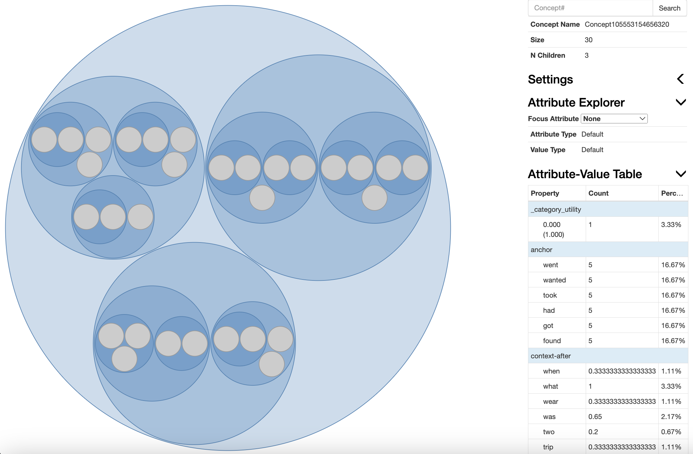

    import os
    import json
    import random as rd
    from random import random, shuffle
    from collections import Counter
    from tqdm import tqdm

    from cobweb.cobweb import CobwebTree
    from cobweb.visualize import visualize
    import string
    import nltk
    import csv
    from nltk.tokenize import word_tokenize

In this example, we use Cobweb to do sentence completions with the [ROCStories Corpora](https://cs.rochester.edu/nlp/rocstories/), which consists of a dozen of 5-sentence stories. To illustrate a simple implementation example, we build a small set of training and test examples. Here is an example 5-sentence story:

> Title: Pop Quiz   
>> The math teacher announced a pop quiz as class began.    
>> While some students complained, he began passing out the quiz.   
>> I took out my pencil and began to work.  
>> About 5 minutes later, I finished.   
>> I stood up feeling confident and turned it in.

By choosing the six most frequent verbs in the corpora, `had`, `went`, `got`, `wanted`, `took`, and `found`, we select five sentences that contain the respective verb in both training and testing sets (so there are `5 * 6 = 30` sentences in each dataset), and arrange them to the text files `./rocstories-tr.txt` and `./rocstories-te.txt`.

First define the global variables:

    seed = 123  # random seed for shuffling instances
    rd.seed(seed)
    window = 5  # the size of the context before/after the anchor word
    verbs = ['had'] * 5 + ['went'] * 5 + ['got'] * 5 + ['wanted'] * 5 + ['took'] * 5 + ['found'] * 5

## Load and preprocess the text data

In the loading and preprocessing process, we load the text data and transform them to instances that can be learned by Cobweb.

    nltk.download('punkt')  # Download NLTK tokenizer data
    def load_and_tokenize_text(file_path):
        rows = []
        tokenized_rows = []
        with open(file_path, 'r', encoding='utf-8') as file:
            for line in file:
                # Tokenize the words in each line
                tokenized_words = word_tokenize(line.lower().strip())
                tokenized_words = [word for word in tokenized_words if word not in string.punctuation]
                rows.append(line.strip())
                tokenized_rows.append(tokenized_words)
        return rows, tokenized_rows

    def sentence2instance(tokens, window, verb):
        instance = {}
        anchor_id = 0
        # Find the anchor:
        for i in range(len(tokens)):
            if tokens[i] == verb:
                instance['anchor'] = {tokens[i]: 1}
                anchor_id = i
                break
        before_anchor = tokens[max(0, anchor_id - window):anchor_id]
        after_anchor = tokens[anchor_id + 1:min(len(tokens), anchor_id + 1 + window)]
        context_before = {}
        context_after = {}
        for i, w in enumerate(before_anchor):
            context_before[w] = 1 / abs(len(before_anchor) - i)
        for i, w in enumerate(after_anchor):
            context_after[w] = 1 / (i + 1)
        instance['context-before'] = context_before
        instance['context-after'] = context_after
        return instance

    def file2instance(file_path, window, shuffle=False):
        rows, token_rows = load_and_tokenize_text(file_path)
        if shuffle:
            ids = list(range(len(rows)))
            rd.shuffle(ids)
            rows = create_list_in_order(rows, ids)
            token_rows = create_list_in_order(token_rows, ids)
            verbs_tr = create_list_in_order(verbs, ids)
        else:
            verbs_tr = verbs
        return [sentence2instance(token_rows[i], window, verbs_tr[i]) for i in range(len(token_rows))], rows

    def create_list_in_order(original_list, index_order):
        new_list = [original_list[i] for i in index_order]
        return new_list

Obtain the preprocessed instances:

    instances_tr, texts_tr = file2instance('rocstories-tr.txt', window, shuffle=True)
    instances_te, texts_te = file2instance('rocstories-te.txt', window)

An example of the training instance (and its corresponding sentence) is as follows:

    {'anchor': {'found': 1}, 
    'context-before': {'until': 0.2, 'she': 0.25, 'was': 0.3333333333333333, 'not': 0.5, 'around': 1.0},
    'context-after': {'the': 1.0, 'game': 0.5, 'and': 0.3333333333333333, 'took': 0.25, 'it': 0.2}}

    Her son waited until she was not around, found the game, and took it.

So the anchor word becomes a sole attribute, and the context words before and after the anchor word becomes the respective attributes within a single instance. Instead of storing the counts of each context word in an instance, we weight these words based on their proximity to the anchor word and their frequency in the snippet, so that the instance can store the propositional information and the co-occurance between words.

Remember to pop the anchor words out from the test instances:

    anchors_te = [list(instance['anchor'].keys())[0] for instance in instances_te]
    instances_te_no_anchors = [{key: values for key, values in instance.items() if key != 'anchor'} for instance in instances_te]

## Train Cobweb

    tree = CobwebTree(0.000001, False, 0, True, False)
    for i in range(len(instances_tr)):
        tree.ifit(instances_tr[i])

Feel free to visualize the concept formation within Cobweb:

    visualize(tree)

<figure>
    
    <figcaption>The visualization interface of the trained Cobweb tree. You can select the attribute you want to focus on with the `Focus Attribute` tab, and select (zoom in/out) the learned concept by directly clicking the concept/cluster circle. The corresponding attribute-value table (i.e. the stored information of a concept node) is shown on the lower right. </figcaption>
</figure>

## Test Cobweb

    test_profile = []
    for i in range(len(instances_te)):
        profile = {
        'sequence': texts_te[i].replace(anchors_te[i], "___"),
        'true-anchor': anchors_te[i],
        }
        predict_probs = tree.categorize(instances_te_no_anchors[i]).predict_probs()
        pred_prob, anchor_pred = sorted([(prob, anchor) for (anchor, prob) in predict_probs['anchor'].items()], reverse=True)[0]
        profile['pred-anchor'] = anchor_pred
        profile['pred-prob'] = pred_prob
        profile['correct'] = anchor_pred == anchors_te[i]
        test_profile.append(profile)

    with open('rocstories-test.csv', 'w', newline='', encoding='utf-8') as file:
        writer = csv.DictWriter(file, fieldnames=test_profile[0].keys())
        writer.writeheader()
        for profile in test_profile:
            writer.writerow(profile)

After these implementation you will find the summary table `./rocstories-test.csv`. Here are the first five rows of the table:

|`sequence` |`true-anchor`  |`pred-anchor`  |`pred-prob`    |`correct`|
|----------|----------|----------|----------|----------|
Eric and his wife ___ a daughter named Meg. |had |  found   | 0.999995  | 0|
Ever since, I've ___ swelling and hypertension. | had   | had   | 0.999995  | 1|
We ___ lunch at Gritty's in Portland.   | had   | wanted    | 0.999995 |    0|
I ___ a nice time and will visit my friend this year.   | had   |got    |0.999995   |0|
James ___ an Xbox 360.  |had|   had |0.999995|  1|

* `sequence`: The tested sentence. The underscore indicates the anchor word Cobweb tries to predict.
* `true-anchor`: The ground-truth anchor word.
* `pred-anchor`: The anchor word predicted by Cobweb.
* `pred-prob`: The predicted probability.
* `correct`: `1` if the prediction is right, `0` otherwise.

----------------------
To see how Cobweb is implemented, please direct to the `README.md` [here](https://github.com/Teachable-AI-Lab/cobweb).

