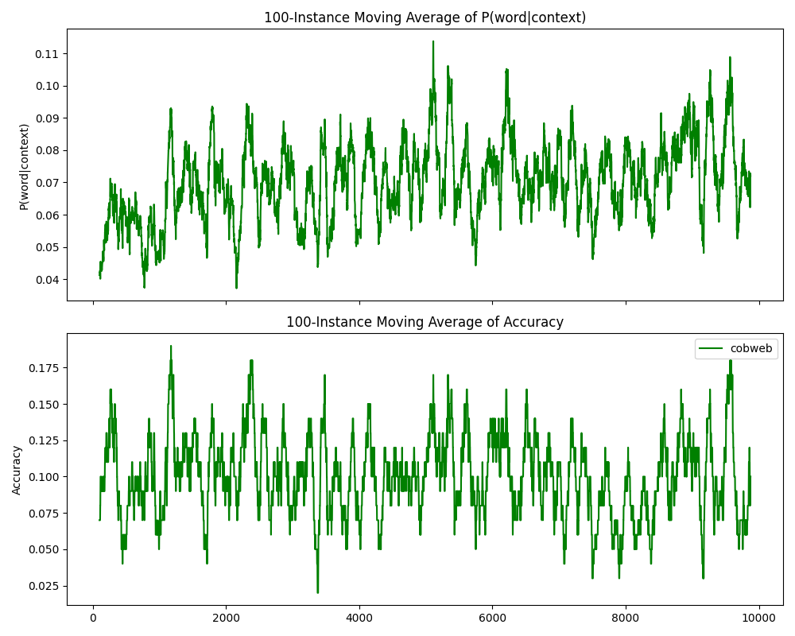

Run the example script simply by entering 

	python3 example-language.py

in the terminal here.

In this example, we implement the [Microsoft Research Sentence Completion Challenge](https://www.microsoft.com/en-us/research/project/msr-sentence-completion-challenge/overview/). In particular, in this example, we preprocess and train Cobweb with only 2 Holmes stories (in `./data`. You can incorporate more from the raw data, though the corresponding training process definitely takes more time), and the stories will be preprocessed by filtering words with less frequencies and then make them into n-grams (anchor + context words) for training and predictions. All the preprocessed grams (instances) will be integrated in the output `holmes_stories.json` as you run the example script. 

Instead of training a certain number of examples and then test out, as an incremental learning system, we show the iterative process of predicting the `anchor` word of the next upcoming instance and then training the instance. 

After all the iterative processes, you can see a visualization of the trained tree and the results table (`cobweb_10_holmes_out.csv` if `window=10`). Here are the descriptions of the result table columns:

| Column | Description |
| --- | ----------- |
| `n_training_words` | The number of instances used to trained in the iteration, or simply the iteration number |
| `n_training_stories` | The index of the story that the instance is from |
| `model` | Model used in the iteration. The value for this example should be `cobweb` |
| `word` | The ground-truth anchor word of the tested instance |
| `word_freq` | The frequency of the anchor word in the stories processed |
| `word_obs_count` | The encountering times of the anchor word so far |
| `vocab_size` | The number of anchor words learned by Cobweb so far |
| `pred_word` | The anchor word prediction for the instance |
| `prob_word` | The predicted probability of the anchor word prediction made |
| `correct` | Whether the prediction is correct. 0 if incorrect, 1 if correct |
| `story` | The corresponding n-gram of the tested instance |

You can derive the learning curve of Cobweb based on the result table:

	python3 plot_curve.py cobweb_10_holmes_out.csv

Like the figure in the following:

<figure>
    
    <figcaption>Example of the output learning curve figure. Top: Number of instances learned vs. Predicted probability of the anchor word of the most recent instance. Bottom: Number of instances learned vs. Accuracy of the batch of instances </figcaption>
</figure>

Which are the anchor word predicted probability evolutions and the accuracy evolutions summarized every `window_size=100` instances.

