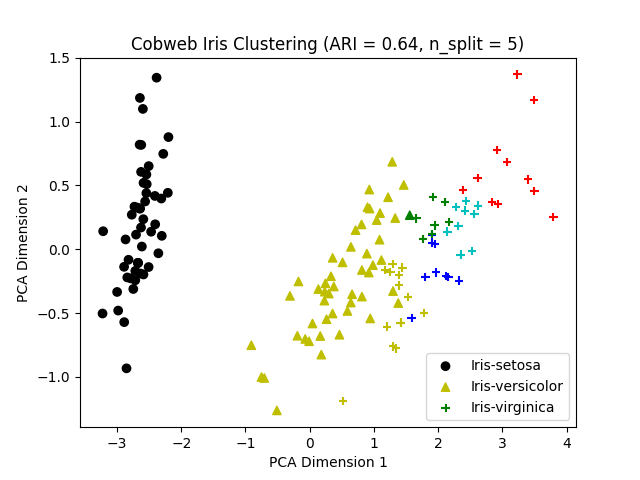

Run the example script simply by entering

	python3 example-cluster-iris.py

in the terminal/command line here. 

Here we employ the [Iris dataset](https://archive.ics.uci.edu/dataset/53/iris) to do an unsupervised clusterng task with the quantitative Cobweb, and each instance is represented with continous (quantitaive) attributes and one nominal attribute indicating its classification. One example is as the following:

	{"class": "Iris-virginica", "petal length": 6.1, "petal width": 2.5, "sepal length": 7.2, "sepal width": 3.6}

its attribute `class` indicates its categorical value, and the remaining attributes are continuous. 

In our example, we remove the `class` attribute for all instances and derive a clustering/partition of the instances based on the concepts of Cobweb, and its detailed process is in the `./cluster.py` script.

### Make a clustering with Cobweb

A partition/clustering can be derived in many ways. Here we generate a "best" partition based on the memberships of the instances among the children concepts of the root of the tree (i.e. the concepts at the 2nd level, right below the root) by recursive simulations.

Given a number of splits, `nth_split` in each recursion, we choose a concept at the 2nd level to split (i.e. remove it and elevate its children to the 2nd level) that results in the greatest category utility of the tree (i.e., the branch including the root and its children), until we have make `nth_split` splits at that level. (Note: `nth_split` does not necessarily equal to the number of clusters/concepts at that level Cobweb has eventually)

### Compare the clustering with ground-truth classifications

After making a clustering of the instances, we compare it with the ground-truth classifications of the instances with the Rand Index (RI), a similarly measure between two clusterings by "considering all pairs of samples and counting pairs that are assigned in the same or different clusters in the predicted and true clusterings". Here we use the [Adjusted Rand Index](https://scikit-learn.org/stable/modules/generated/sklearn.metrics.adjusted_rand_score.html) (ARI). When it is closer to 1.0, both clusterings are more similar to each other.

### Visualization of the clustering

To viusalize the clustering made by Cobweb, we first reduce the dimensions to 2D by principle component analysis, then generate the scatterplots of the instances along with their classification/membership of clusters.

One example when the number of split is 3:

<figure>
    
    <figcaption>Example of the clustering by Cobweb when the number of splits is 3. </figcaption>
</figure>

- the datapoints sharing the same color belongs to the same cluster made by Cobweb, and
- the datapoints sharing the same shape (circle, triangle, etc.) belongs to the same ground-truth classification.

For this example clustering, the ARI value is 0.74, indicating the cluster's great alignment with the actual classes.

Another example when the number of split is 5:

<figure>
    
    <figcaption>Example of the clustering by Cobweb when the number of splits is 5. </figcaption>
</figure>

To see how the quantitaive Cobweb (or Cobweb/4V) is implemented, please direct to the `README.md` [here](https://github.com/Teachable-AI-Lab/cobweb).

