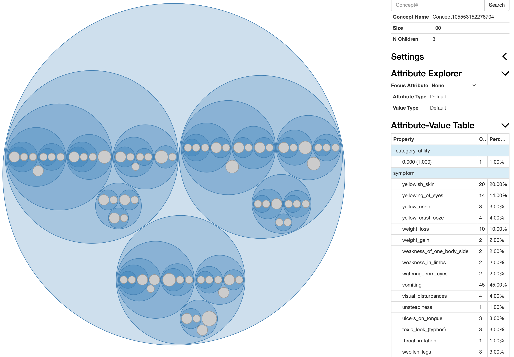

Here we present an implementation example based on the [Disease Symptom Prediction dataset](https://www.kaggle.com/datasets/itachi9604/disease-symptom-description-dataset?select=dataset.csv) (`diagnose.csv` in the current directory) on Kaggle to make diagnosis based on the symptoms people might have.

If you don't find the compiled Python library of Cobweb from `cobweb.cpp` with `pybind11`, please see the `README.md` [here](https://github.com/Teachable-AI-Lab/cobweb/tree/main). 

    from random import shuffle, seed, sample
    import time
    import csv
    import numpy as np
    import pandas as pd
    from copy import copy, deepcopy
    from tqdm import tqdm
    from cobweb.cobweb import CobwebTree
    from cobweb.visualize import visualize

Suppose we have the global variable values:

    size_tr = 100
    random_seed = 32
    verbose = True

`size_tr`: the size of the training set (the remaining data is then used for prediction)
`random_seed`: the random seed

## Data Overview and Preprocessing

A snippet of the dataset is as the following:

| Disease | Symptom_1 | Symptom_2 | Symptom_3 | Symptom_4 | Symptom_5 | Symptom_6 | Symptom_7 | Symptom_8 | Symptom_9 | Symptom_10 | Symptom_11 | Symptom_12 | Symptom_13 | Symptom_14 | Symptom_15 | Symptom_16 | Symptom_17 |
| --- | --- | --- | --- | --- | --- | --- | --- | --- | --- | --- | --- | --- | --- | --- | --- | --- | --- |
| Fungal infection | itching | skin_rash | nodal_skin_eruptions | dischromic _patches | | | | | | | | | | | | |
| Fungal infection | skin_rash | nodal_skin_eruptions | dischromic _patches | | | | | | | | | | | | | |
| Fungal infection | itching | nodal_skin_eruptions | dischromic _patches | | | | | | | | | | | | | |
| Fungal infection | itching | skin_rash | dischromic _patche | | | | | | | | | | | | | |
| Fungal infection | itching | skin_rash | nodal_skin_eruptions | | | | | | | | | | | | | |

Each row is an instance case from a patient - `Disease` indicates the disease diagnosed, and the `Symptom_x` columns list the symptoms one patient has. To make use of the dataset with Cobweb, we need to preprocess the data: transform the tabular data to dictionaries in Python, so that each case has the representation like the following:

    {'disease': {'hepatitis-a': 1}, 
     'symptom': {'joint_pain': 1, 'vomiting': 1, 'yellowish_skin': 1, 'dark_urine': 1, 'nausea': 1, 'loss_of_appetite': 1, 'abdominal_pain': 1, 'diarrhoea': 1, 'mild_fever': 1, 'yellowing_of_eyes': 1, 'muscle_pain': 1}}

each of which has two key-value pairs: `disease` and `symptom`, and the corresponding values are the feature value along with their counts (always 1 in this case since each patient obviously doesn't have replicates on their symptoms or diagnosed diseases).

To do this we can proceed with the following:

    instances = []
    with open("diagnose.csv", 'r') as fin:
        csv_reader = csv.reader(fin)
        header = next(csv_reader)
        for row in csv_reader:
            instance = {'disease': {row[0].lower().replace(' ', '-'): 1}}
            symptom_dict = {}
            for i in range(1, len(row)):
                if row[i] == '':
                    break
                symptom_dict[row[i].lower().replace(' ', '')] = 1
            instance['symptom'] = symptom_dict
            instances.append(instance)

After preprocessing, generate the training and testing datasets:

    seed(random_seed)  # initiate the random seed
    shuffle(instances)  # shuffle the instances
    instances_tr = instances[:size_tr]  # the training set
    instances_te = instances[size_tr:]
    diseases_te = [list(instance['disease'].keys())[0] for instance in instances_te]  # the diseases of the test set
    instances_te = [{k: v for k, v in instance.items() if k != 'disease'} for instance in instances_te]  # the test set (the "disease" attribute is removed from all test instances)

## Train Cobweb

First initialize the `CobwebTree` object:

    tree = CobwebTree(0.001, False, 0, True, False)

Then train it with the training set:

    for instance in tqdm(instances_tr):
        tree.ifit(instance)

## Visualization of the Trained Cobweb Tree

After training the tree, you can visualize the tree with the following:

    visualize(tree)

to see the concept information of the trained Cobweb tree via a browser (with `cobweb/cobweb/visualization_files/viz.html` launched. It should pop out automatcially after executing the code):

<figure>
    
    <figcaption>The visualization interface of the trained Cobweb tree. You can select the attribute you want to focus on with the `Focus Attributer` tab, and select (zoom in/out) the learned concept by directly clicking the concept/cluster circle. The corresponding attribure-value table (i.e. the stored information of a concept node) is shown on the lower right. </figcaption>
</figure>

## Predict the Unobeserved Attribute Value of a Given Instance

We can then use the trained Cobweb tree to predict the disease one has based on the symptoms the case have:

    # given some test case:
    instance = instances_te[0]
    prob_pred = tree.predict_probs(instance, 50, False, False, 1)
    disease_pred = sorted([(prob, disease) for (disease, prob) in prob_pred['disease'].items()], reverse=True)[0][1]  # return the disease value having the greatest predicted probability among all possible ones

You may change maximum number of nodes used in making an ensembled prediction instead of 50 (and theoretically the performance will be better). The output `prob_pred` is as follows:

    {'symptom': {'spinning_movements': 4.9560306864814686e-05, 'swollen_extremeties': 4.916018812318526e-05, 'unsteadiness': 4.9560306864814686e-05, 'sunken_eyes': 4.915964469856388e-05, 'knee_pain': 4.916018812318526e-05, ...... 'joint_pain': 4.916670921864184e-05}, 
    'disease': {'aids': 0.0002448647244147912, 'typhoid': 0.0002448729173612014, 'hepatitis-a': 0.0002448729173612014, ......, 'arthritis': 0.0002448729173612014}}

which is the collection of the predicted probabilities of all possible values for each attribute.

And the predicted disease in this case is `impetigo`, which is the same as the ground-truth one.

In this way we can derive the test accuracy of the test set:

    n_correct = 0
    diseases_pred = []
    for i in tqdm(range(len(instances_te))):
        instance = instances_te[i]
        probs_pred = tree.predict_probs(instance, 50, False, False, 1)
        disease_pred = sorted([(prob, disease) for (disease, prob) in probs_pred['disease'].items()], reverse=True)[0][1]
        if disease_pred == diseases_te[i]:
            n_correct += 1
        diseases_pred.append(disease_pred)
    accuracy = n_correct / len(instances_te)
    print(f"The test accuracy of Cobweb after training {size_tr} samples: {accuracy}")

Expected output:

    The test accuracy of Cobweb after training 100 samples: 0.975103734439834

So we eventually reach an accuracy of about 97.51% with merely 100 training samples.

## Multi-task Learning: Predict the Symptoms of Some Disease

One thing distinguishes Cobweb from many other models/systems is its potential of multi-task learning - since there is no necessary "response/dependent variable" in learning via Cobweb, one can always derive the predictions of the attribute values other than some specific one (in this case, `disease`).

In this example, after learning a couple of instances, we can not only predict the disease given a set of symptoms, but also derive the "typical" symptoms given a specific disease:

    instance_te_disease = {'disease': {'diabetes-': 1}}
    probs_pred = tree.categorize(instance_te_disease).get_basic_level().predict_probs()  # capture the summary based on its "basic-level" concept
    symptoms_pred = sorted([(prob, symptom) for (symptom, prob) in probs_pred['symptom'].items()], reverse=True)[:10]

The output `symptoms_pred` lists the 10 most possible symptoms of `diabetes` based on its learned cases:

    [(0.057227984907375226, 'fatigue'), (0.05341304024320657, 'irritability'), (0.0419682062507006, 'excessive_hunger'), (0.03815326158653194, 'skin_rash'), (0.034338316922363284, 'blurred_and_distorted_vision'), (0.026708427594025967, 'sweating'), (0.026708427594025967, 'stiff_neck'), (0.026708427594025967, 'mood_swings'), (0.026708427594025967, 'depression'), (0.026708427594025967, 'abnormal_menstruation')]

---------------------------

To see how Cobweb is implemented in detail, please direct to the `README.md` [here](https://github.com/Teachable-AI-Lab/cobweb).

