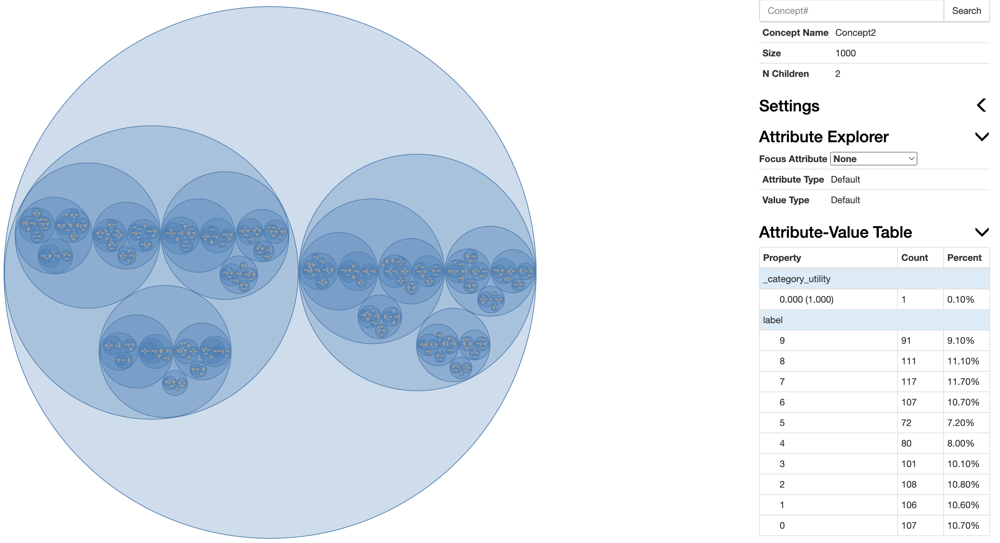

Run the example script simply by entering 

    python3 example-vision.py

in the terminal/commmand line here. Make sure you have installed PyTorch first to implement the example, since we require Tensor representations of the instances (images).

In this example, we trained Cobweb/4V with sampled 1000 (out of 60,000) training examples in the [MNIST](https://pytorch.org/vision/main/generated/torchvision.datasets.MNIST.html#torchvision.datasets.MNIST) dataset, and then test it with the entire MNIST test set (10,000 test examples in total). You can try different settings by changing the global variables defined in the example script. Lastly, we can derive the visualization of the trained Cobweb/4V tree.

Each MNIST image is represented by a tensor of pixel values like the following:

    tensor([[[0.0000, 0.0000, 0.0000, 0.0000, 0.0000, 0.0000, 0.0000, 0.0000,
          0.0000, 0.0000, 0.0000, 0.0000, 0.0000, 0.0000, 0.0000, 0.0000,
          0.0000, 0.0000, 0.0000, 0.0000, 0.0000, 0.0000, 0.0000, 0.0000,
          0.0000, 0.0000, 0.0000, 0.0000],
         ...
         [0.0000, 0.0000, 0.0000, 0.0000, 0.0000, 0.0000, 0.0000, 0.0000,
          0.0000, 0.0000, 0.0000, 0.4627, 0.9922, 0.9922, 0.9922, 0.1490,
          0.0000, 0.0000, 0.0000, 0.0000, 0.0000, 0.0000, 0.0000, 0.0000,
          0.0000, 0.0000, 0.0000, 0.0000],
         ...
         [0.0000, 0.0000, 0.0000, 0.0000, 0.0000, 0.0000, 0.0000, 0.0000,
          0.0000, 0.0000, 0.0000, 0.0000, 0.0000, 0.0000, 0.0000, 0.0000,
          0.0000, 0.0000, 0.0000, 0.0000, 0.0000, 0.0000, 0.0000, 0.0000,
          0.0000, 0.0000, 0.0000, 0.0000]]])

If an image is used for training, its ground-truth label (digit) is used along with the image tensor in the training process.

## Vision Example Walkthrough:

    import numpy as np
    import torch
    import matplotlib.pyplot as plt
    from torch.utils.data import Dataset, DataLoader, Subset, ConcatDataset
    from torchvision import datasets, transforms
    from cobweb.visualize import visualize
    import copy
    import random
    from tqdm import tqdm
    from cobweb.cobweb_torch import CobwebTorchTree

 First, we set up the configurations as well as the random seed for fixed shuffling:

    # Configurations:
    size_tr = 1000  # the size of the example training set
    size_te = 10000  # the size of the example test set
    normalize = False  # If true, normalize the MNIST training/test set
    download = True  # Download a copy of MNIST dataset
    seed = 123  # random seed used for shuffling
    cuda = False  # We may just keep cuda=False since the training/predicting process will not be boosted with GPUs
    verbose = True
    random.seed(seed)

 Then, we load MNIST dataset:

    dataset_class = datasets.MNIST
    transform = [transforms.ToTensor()]
    if normalize:
        transform.append(transforms.Normalize((0.1307,), (0.3081,)))
    dataset_transform = transforms.Compose(transform)
    dataset_tr = dataset_class('./datasets/MNIST', train=True, download=download, transform=dataset_transform)
    dataset_te = dataset_class('./datasets/MNIST', train=False, download=download, transform=dataset_transform)
    
    # Return <DataLoader> object for the provided dataset object.
    def get_data_loader(dataset, batch_size, cuda=cuda, drop_last=False, shuffle=False):
        return DataLoader(dataset, batch_size=batch_size, shuffle=shuffle, drop_last=drop_last,
                          **({'num_workers': 0, 'pin_memory': True} if cuda else {}))
    
And generate example training/test DataLoaders:

    # Generate an example training DataLoader.
    dataset_indices_tr = list(range(len(dataset_tr)))
    random.shuffle(dataset_indices_tr)
    dataset_indices_tr = dataset_indices_tr[:size_tr]
    loader_tr = get_data_loader(Subset(dataset_tr, dataset_indices_tr), 
        batch_size=size_tr, cuda=cuda, drop_last=False, shuffle=True)
    
    # Generate an example test DataLoader.
    dataset_indices_te = list(range(len(dataset_te)))
    random.shuffle(dataset_indices_te)
    dataset_indices_te = dataset_indices_te[:size_te]
    loader_te = get_data_loader(Subset(dataset_te, dataset_indices_te), 
        batch_size=size_te, cuda=cuda, drop_last=False, shuffle=True)

### Train the Cobweb Tree

First, initialize the tree:

    imgs_tr, labels_tr = next(iter(loader_tr))
    tree = CobwebTorchTree(imgs_tr.shape[1:])

This code will render one of the images:

    plt.imshow(imgs_tr[0][0])
    plt.show()

Then, train the instances:

    if verbose:
        print("Start Training.")
    for i in tqdm(range(imgs_tr.shape[0])):
        tree.ifit(imgs_tr[i], labels_tr[i].item())

You can visualize the concepts generated in the trained tree:

    visualize(tree)

<figure>
    
    <figcaption>
The visualization interface of the trained Cobweb tree. You can select the attribute you want to focus on with the `Focus Attributer` tab, and select (zoom in/out) the learned concept by directly clicking the concept/cluster circle. The corresponding attribure-value table (i.e. the stored information of a concept node) is shown on the lower right. </figcaption>
</figure>

### Predict the Class of a Given Instance

Now, we can predict the class of images in the testing set:

    imgs_te, labels_te = next(iter(loader_te))
    pred_labels = []
    if verbose:
        print("Start Predicting.")
    for i in tqdm(range(imgs_te.shape[0])):
        # Make a prediction:
        pred_probs = tree.predict_probs(imgs_te[i], None, max_nodes=50)
        pred_label = torch.tensor(sorted([(pred_probs[l], l) for l in pred_probs], reverse=True)[0][1])
        pred_labels.append(pred_label)

And, find the accuracy for label predictions:

    correct = [1 if pred_labels[i] == labels_te[i] else 0 for i in range(len(pred_labels))]
    accuracy = sum(correct) / len(imgs_te)

The predictions on all test data may takes a couple of minutes, and with the default global variances defined in the script, you should expect to obtain a test accuracy within the range of 80% to 82%, in the end.

To see how Cobweb/4V is implemented, please direct to the `README.md` [here](https://github.com/Teachable-AI-Lab/cobweb).
